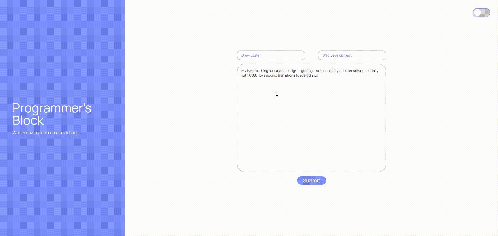

# Personal Coding Blog

## Welcome!
Thanks you for checking out my personal blog! It used HTML, CSS, and Javascript to provide a seamless blogging experience!

### How to use - 
To get started, simply enter in a username, blog title, and whatever is on your mind! Once you submit the blog post, you'll be taken to the post page where all of your blog inputs will be displayed! 

If you'd like, you can enter into the dev tools section by pressing 'F12' and you will see that all of the posts are stored in localStorage! 

If you want to create a new post, simply press the back arrow to get back to the main page! Also, if you prefer a darker theme, just click the toggle switch on the top right of the page. 

[Click here to check out the blog!](https://drewheaster.github.io/personal-blog/)

Happy coding!
